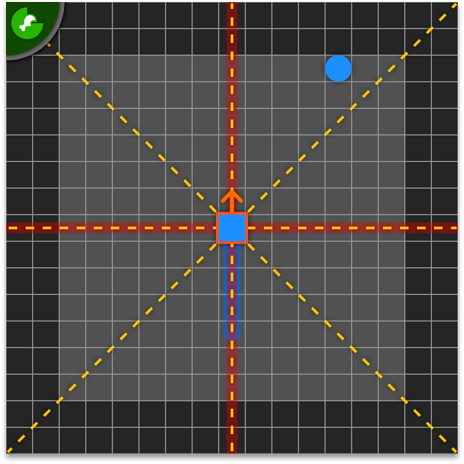
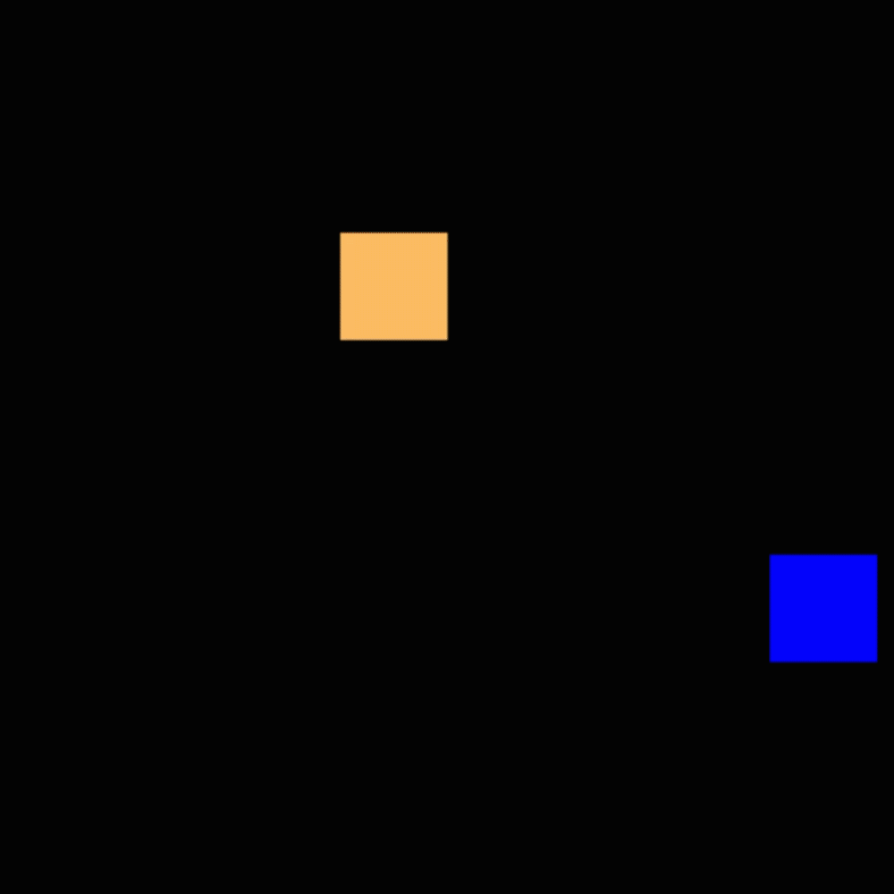

# PPO (Proximal Policy Optimization) - Reinforcement Learning

## Snake-AI

[](https://forthebadge.com)\
\
[]()
[]()
[](https://www.gnu.org/licenses/gpl-3.0)
[](https://travis-ci.com/IcarusCoding/Speed)
[]()
[]()

## [Observation](src/snakeAI/gym_game/snake_env/observation.py)

### Visual observation
- Visual observation. The AI is observing a 13x13 space around this head. Six on the left and right site and the Head in the middle.
### Static observation
- Ray tracing along the yellow dashed lines. The AI is able to see himself, walls and the apple.
- Direction (red line) of the snake.
- apple (blue point) and tail compass. Indicates the relativ position according to the apple or the last part of the snake.
- step counter. If the snake doesn't eat an apple in a descried amount of steps the game ends.

## [Evaluation / Reward](src/snakeAI/gym_game/snake_env/snake_game_2d.py)
### +100 if the snake reaches the max length. | win
### +2.5 if snake eats an apple.
### -10 if the snake dies. | loss


## [PPO - Implementation](src/snakeAI/agents/ppo/actor_critic.py)
The current built of my PPO was inspired by:\
Phil Tabor: [Phil Tabor - Repository](https://github.com/philtabor/Youtube-Code-Repository/tree/master/ReinforcementLearning/PolicyGradient/PPO/torch) \
Nikhil Barhate: [nikhilbarhate99 - Repository](https://github.com/nikhilbarhate99/PPO-PyTorch)


## References
- [PPO paper](https://arxiv.org/abs/1707.06347)


## License
#### GPLv3 (General Public License 3)


## Results



## Dependencies
```
Libraries           | Functions
-----------------------------------------------
...                 | ...
python 3.7          | Python version
gym 0.18.0          | Game setup
pygame 2.0.0        | Game gui
numpy 1.20.1        | Creating observations
Pytorch 1.8.0cuda   | AI-API
ray 1.2.0           | Multiprocessing framework
scipy 1.5.2         | Linear regression
matplotlib 3.3.2    | Result plots
 
```
